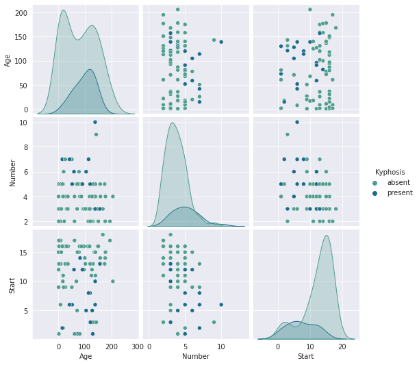

<h1> DECISION TREES AND RANDOM FORESTS </h1>
___
Decision Trees are the trees used to classify objects, based on various attributes.<br>

<br>

<p>It can be used to solve the Candidate Elimination Problem!</p>

<p>Now, by using only a single tree structure, we cannot reliably predict the class. Therefore, we use random forests.</p><br>


<br> <p>In a random forests, we randomly generate multiple trees and take the average class of all the predicted classes of each tree, the advantage is that we can more accurately predict the class of the object, as there is a higher randomized factor in predicting the class</p>

### Data Visualisation
<p>We visualise the data using seaborn's pairplot(). The dataset we are working on is for Kyphosis patients, which is an abnormal bending of the backbone. The attributes to be considered are Age, Number and start.


```python
import pandas as pd
import numpy as np
import matplotlib.pyplot as plt
import seaborn as sns
%matplotlib inline
```


```python
df = pd.read_csv('kyphosis.csv')
df.head()
```


<div>
<style scoped>
    .dataframe tbody tr th:only-of-type {
        vertical-align: middle;
    }

    .dataframe tbody tr th {
        vertical-align: top;
    }

    .dataframe thead th {
        text-align: right;
    }
</style>
<table border="1" class="dataframe">
  <thead>
    <tr style="text-align: right;">
      <th></th>
      <th>Kyphosis</th>
      <th>Age</th>
      <th>Number</th>
      <th>Start</th>
    </tr>
  </thead>
  <tbody>
    <tr>
      <th>0</th>
      <td>absent</td>
      <td>71</td>
      <td>3</td>
      <td>5</td>
    </tr>
    <tr>
      <th>1</th>
      <td>absent</td>
      <td>158</td>
      <td>3</td>
      <td>14</td>
    </tr>
    <tr>
      <th>2</th>
      <td>present</td>
      <td>128</td>
      <td>4</td>
      <td>5</td>
    </tr>
    <tr>
      <th>3</th>
      <td>absent</td>
      <td>2</td>
      <td>5</td>
      <td>1</td>
    </tr>
    <tr>
      <th>4</th>
      <td>absent</td>
      <td>1</td>
      <td>4</td>
      <td>15</td>
    </tr>
  </tbody>
</table>
</div>


```python
sns.set_style("darkgrid")
sns.pairplot(df,hue="Kyphosis",palette="crest")
```


    <seaborn.axisgrid.PairGrid at 0x7f8c2675b610>


    

    


### Train Test Split


```python
from sklearn.model_selection import train_test_split
```


```python
X = df.drop('Kyphosis',axis=1)
```


```python
y = df['Kyphosis']
```


```python
X_train, X_test, y_train, y_test = train_test_split(X, y, test_size=0.5)
```

### Creating a Decision Tree


```python
from sklearn.tree import DecisionTreeClassifier
```


```python
dtree = DecisionTreeClassifier()
dtree.fit(X_train,y_train)
```


    DecisionTreeClassifier()


```python
predictions = dtree.predict(X_test)
```


```python
from sklearn.metrics import classification_report,confusion_matrix
```


```python
print(confusion_matrix(y_test,predictions))
print("")
print(classification_report(y_test,predictions))
```

    [[27  5]
     [ 5  4]]
    
                  precision    recall  f1-score   support
    
          absent       0.84      0.84      0.84        32
         present       0.44      0.44      0.44         9
    
        accuracy                           0.76        41
       macro avg       0.64      0.64      0.64        41
    weighted avg       0.76      0.76      0.76        41
    


### Using Random Forests


```python
from sklearn.ensemble import RandomForestClassifier
```


```python
rfc = RandomForestClassifier(n_estimators=200) #n_estimators is no of trees
```


```python
rfc.fit(X_train,y_train)
```


    RandomForestClassifier(n_estimators=200)


```python
rfc_pred = rfc.predict(X_test)
```


```python
print(confusion_matrix(y_test,rfc_pred))
print("")
print(classification_report(y_test,rfc_pred))
```

    [[29  3]
     [ 8  1]]
    
                  precision    recall  f1-score   support
    
          absent       0.78      0.91      0.84        32
         present       0.25      0.11      0.15         9
    
        accuracy                           0.73        41
       macro avg       0.52      0.51      0.50        41
    weighted avg       0.67      0.73      0.69        41
    


In this case, the dataset is too small to efficiently utilise random forests, and the precision is actually better in using a single decision tree. Also, the dataset has way more false cases than true cases. To check this,


```python
df['Kyphosis'].value_counts()
```


    absent     64
    present    17
    Name: Kyphosis, dtype: int64


